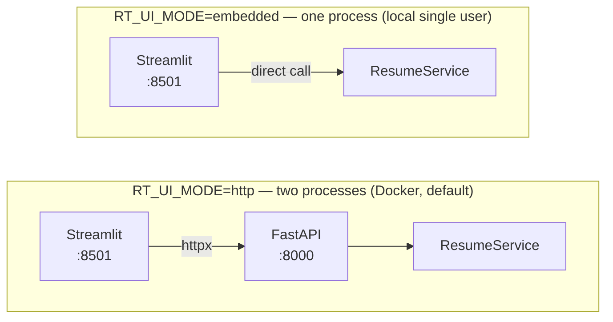
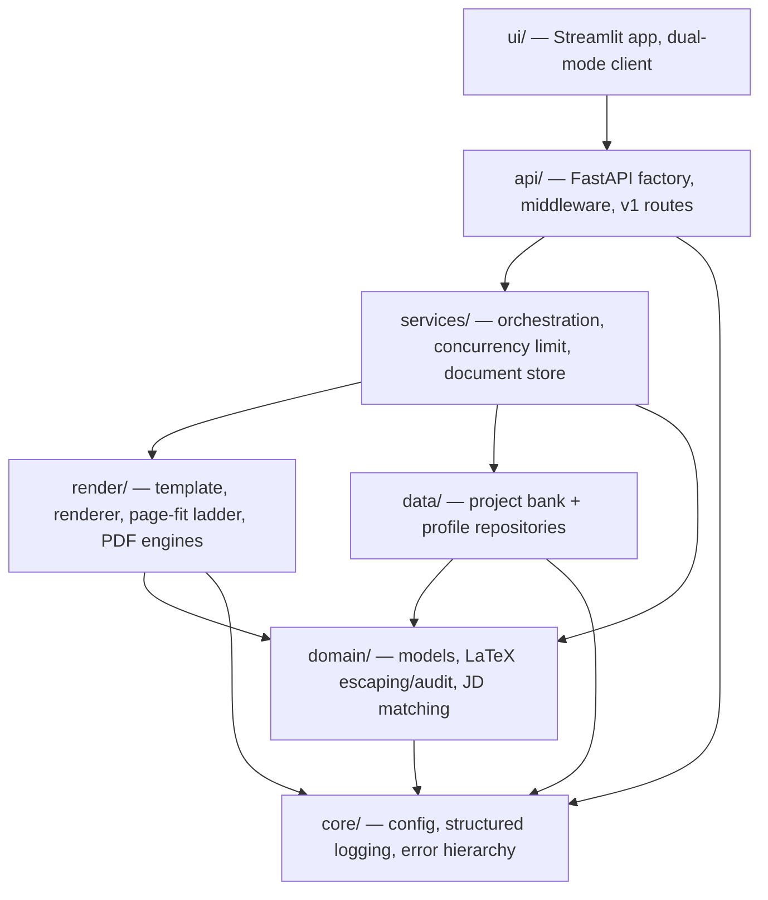
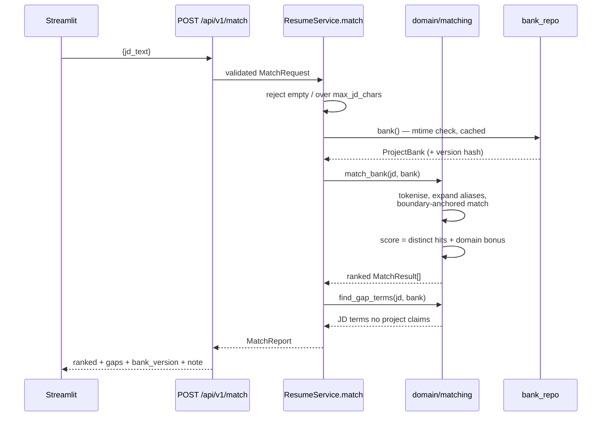
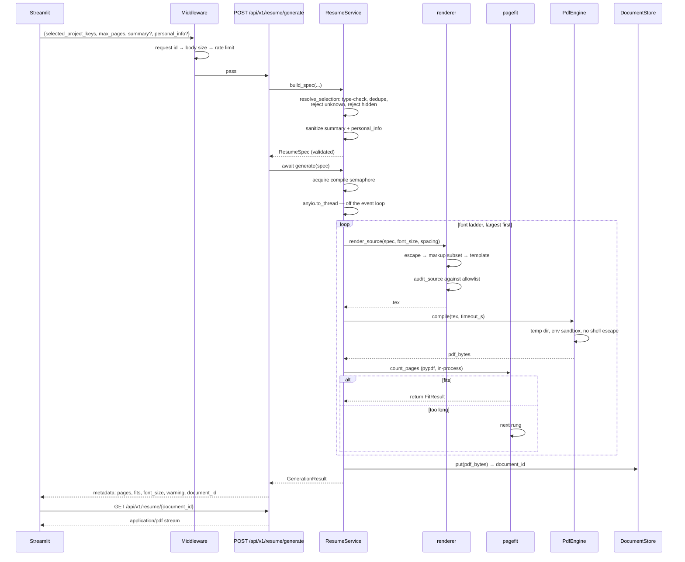
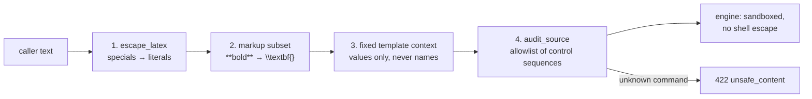

# Architecture and Workflow

How the system is built, how a request moves through it, and how to work on it.

For *what* the tool does, see the [README](../README.md). For the audit of the
previous implementation that motivated this shape, see [PLAN.md](PLAN.md).

---

## Contents

1. [The two invariants](#1-the-two-invariants)
2. [Topology](#2-topology)
3. [Layers and the dependency rule](#3-layers-and-the-dependency-rule)
4. [Module reference](#4-module-reference)
5. [Workflow: matching a job description](#5-workflow-matching-a-job-description)
6. [Workflow: generating a resume](#6-workflow-generating-a-resume)
7. [The page-fit ladder](#7-the-page-fit-ladder)
8. [The text-safety pipeline](#8-the-text-safety-pipeline)
9. [Error model](#9-error-model)
10. [Configuration](#10-configuration)
11. [Developer workflow](#11-developer-workflow)
12. [Design decisions worth explaining](#12-design-decisions-worth-explaining)
13. [What is deliberately absent](#13-what-is-deliberately-absent)

---

## 1. The two invariants

Everything else in this document is in service of these two properties. If a
change breaks either one, the change is wrong.

### The no-generation boundary

**The tool never writes resume prose.** Every bullet it can place on a page was
written and fact-checked by a human in advance, and lives in
`data/project_bank.json` or `data/profile.yaml`. The system's job is
*selection, ordering and formatting* of already-approved content.

This is a correctness guarantee, not a missing feature. A program that invents
resume claims cannot verify they are true, and an unverifiable claim on a
resume is worse than a smaller pool of verified ones.

### The page-fit guarantee

> For every generated resume, either `page_count <= max_pages`, or `warning` is
> non-empty. **Never neither.**

Enforced in `render/pagefit.py`, and tested as a Hypothesis property over the
whole input space rather than by example. It exists because a hand-built resume
once silently compiled to three pages and shipped before anyone noticed.

---

## 2. Topology

The same code runs in two arrangements, chosen by `RT_UI_MODE`.



`ui/client.py` defines one interface with both implementations behind it, so
`ui/app.py` is identical in either mode. The embedded client calls the **v1
route handlers**, not the service directly — reimplementing the
domain-object-to-response-model mapping would let the two modes drift, and the
drift would surface as the UI disagreeing with the API about what a resume is.

---

## 3. Layers and the dependency rule



**Dependencies point inwards only.** `domain/` imports nothing from the project
outside `core/`, which is exactly why it can be tested exhaustively and held to
100% coverage. `core/` imports nothing from the project at all.

**Every layer boundary is a validated pydantic model.** Nothing crosses one as
a raw `dict`. That is what makes a whole class of "unexpected key crashes the
renderer" failure *unrepresentable* rather than merely guarded against — see
[§12](#a-fixed-template-context).

---

## 4. Module reference

### `core/` — foundations

| Module | Responsibility |
|---|---|
| `config.py` | `Settings` (pydantic-settings, `RT_` prefix). Validated at startup, so a bad value fails immediately with a clear message rather than booting degraded. |
| `logging.py` | structlog setup. A processor redacts email and phone before emit, so PII never reaches a log sink. |
| `errors.py` | `AppError` hierarchy. Each subclass carries a stable machine-readable `code` and an HTTP `status_code`, and renders to RFC 7807 `application/problem+json`. |

### `domain/` — pure logic, no I/O

| Module | Responsibility |
|---|---|
| `models.py` | `Project`, `ProjectBank`, `PersonalInfo`, `Profile`, `MatchResult`, `MatchReport`, `ResumeSpec`. All `extra="forbid"`. |
| `latex.py` | Escaping, display-text conversion, the `**bold**` markup subset, and the audit primitives: `ALLOWED_COMMANDS`, `find_unknown_commands`, `find_unescaped_specials`, `count_unbalanced_braces`. |
| `matching.py` | Boundary-anchored keyword scoring, alias expansion, domain bonus, gap-term extraction. |

### `data/` — content loading

| Module | Responsibility |
|---|---|
| `bank_repo.py` | Loads and validates `project_bank.json`. Cached with mtime invalidation, so editing the file is picked up without a restart. Exposes a content hash as `bank_version`. |
| `profile_repo.py` | Same contract for `profile.yaml`. |

### `render/` — source to bytes

| Module | Responsibility |
|---|---|
| `template_env.py` | Jinja environment using `\VAR{}` / `\BLOCK{}` delimiters instead of braces. |
| `renderer.py` | `ResumeSpec` → `.tex`, then `audit_source()` — the allowlist check — before anything reaches a compiler. Also the single `_href()` chokepoint every link on the page is built through. |
| `pagefit.py` | The font ladder and the page-fit guarantee. Counts pages in-process with `pypdf`. |
| `engines/base.py` | `PdfEngine` protocol and `SubprocessEngine` — temp dir, env sandbox, timeout, size cap, typed failures. |
| `engines/tectonic.py` | Default engine. One self-contained binary. |
| `engines/pdflatex.py` | For existing TeX installs; used in the API container. |
| `engines/fake.py` | In-process, emits real multi-page PDFs. The load-bearing one for testing. |
| `engines/registry.py` | `auto` probing and selection. Refuses to fall back to `fake` when `RT_ENVIRONMENT=prod`. |

### `services/` — orchestration

| Module | Responsibility |
|---|---|
| `resume_service.py` | The only thing the API and the UI both call. Validation, selection resolution, spec assembly, compile orchestration, the concurrency semaphore. |
| `document_store.py` | Thread-safe, bounded, TTL'd in-memory store of generated PDFs, keyed by `document_id`. |

### `api/` — HTTP

| Module | Responsibility |
|---|---|
| `main.py` | `create_app()` factory (which is also where the service is built — *not* the lifespan handler), middleware stack, the four exception handlers. |
| `middleware.py` | `RequestContextMiddleware` (correlation ids), `BodySizeLimitMiddleware` (pure ASGI — see below), `RateLimitMiddleware`. |
| `schemas.py` | Request and response models — the public contract, separate from domain models. |
| `v1/` | `health`, `meta`, `projects`, `match`, `resume`. |

### `ui/` — Streamlit

| Module | Responsibility |
|---|---|
| `app.py` | Entrypoint and page layout. |
| `client.py` | The dual-mode backend client (HTTP and embedded). |
| `components.py` | JD input, project picker, gap report, result panel. |
| `state.py` | Typed `session_state` schema. |

---

## 5. Workflow: matching a job description



**Scoring.** Each project scores one point per *distinct matched span* in the
JD, plus `DOMAIN_BONUS = 2` if a domain tag matches. Counting spans rather than
pattern hits is what stops a keyword and its alias double-counting the same
mention — a bug found during the rebuild, not in the original audit.

`coverage` is reported alongside `score`: the fraction of the project's own
keywords the JD mentions. Score alone favours projects with long keyword lists;
coverage does not.

**Matching is boundary-anchored, not substring.** The bank genuinely contains
the keyword `r`, and substring containment made it match almost any input —
"R&D, Rust and Ruby" once scored the ARIMA project above every relevant one.

**Zero score is not zero relevance.** The response says so in its `note` field,
and the UI deprioritises zero-score projects rather than hiding them.

---

## 6. Workflow: generating a resume



**Generate and download are separate requests.** `POST .../generate` returns
metadata — page count, whether it fits, which font size was needed, any
warning. `GET .../{id}` streams the bytes. The previous version base64-encoded
the PDF into the JSON body, inflating it by a third and wrapping the warning a
user most needed to read around a megabyte of encoded document.

**Compilation never runs on the event loop.** It is a multi-second blocking
subprocess; running it directly in an `async def` route would stall every other
request for its whole duration. `generate()` acquires a semaphore
(`RT_MAX_CONCURRENT_COMPILES`, default 2) and dispatches to
`anyio.to_thread`.

---

## 7. The page-fit ladder

The default ladder, from `Settings.font_ladder`:

| Rung | Font size | Line spacing |
|---|---|---|
| 1 | 9.6pt | 11.5 |
| 2 | 9.4pt | 11.3 |
| 3 | 9.2pt | 11.0 |
| 4 | 9.0pt | 10.8 |
| 5 | 8.8pt | 10.6 |

**8.8pt is a deliberate readability floor.** Below it, a slightly longer resume
is the better trade — so the ladder ends and the tool reports failure rather
than shrinking further.

Each rung is a fresh render, because font size is itself a template variable.
Three behaviours are worth knowing:

- **Exhaustion still returns a PDF.** The caller gets the smallest-font attempt
  with `warning` set, so they have something to look at while deciding what to
  cut. The warning says to *trim content*, not to shrink further.
- **A compile error on rung 1 aborts immediately.** A LaTeX syntax error is not
  a function of font size; retrying four more times only multiplies the wait
  before the identical error.
- **An empty ladder is rejected up front.** It used to leave `last_result` as
  `None` and then crash on `None.warning`.

---

## 8. The text-safety pipeline

Free text — a `summary` or `personal_info` field from a request body — passes
through four stages before a compiler sees it.



The ordering is the point. **Escape first, then re-enable a markup subset:** by
the time the markup pass runs, any LaTeX the caller typed is already inert
literal characters, and `*` means nothing to LaTeX. The feature is safe by
construction rather than by vigilance.

Stage 4 is an **allowlist, not a denylist**. A denylist silently permits every
dangerous primitive nobody thought of; an allowlist rejects the unanticipated
by default. Adding legitimate new markup to the bank means adding one entry to
`ALLOWED_COMMANDS` in `domain/latex.py`, and the error names the exact command
to add.

`audit_source()` splits its findings by severity. An off-allowlist control
sequence or an unbalanced brace **raises** `UnsafeContentError` (422) — nothing
reaches a compiler. An unescaped special character is returned as a **non-fatal
warning**, logged and surfaced on the response, because it is a content-quality
signal rather than an execution risk. That distinction matters: the equivalent
check in the original code was well written and never called from anywhere
(defect B8).

### Link targets: the one value that is never escaped

Stages 1-4 above handle everything that is *typeset*. A link **target** is the
exception, and it needs its own paragraph because the diagram does not describe
it: `\href{https://example.com/a_b}` has to reach the document literally, since
escaping the URL breaks the link.

That removes stage 1 for those fields, and stage 4 cannot substitute for it.
`\href` is a command the template legitimately emits, so it is on the allowlist
by necessity, and an allowlist cannot tell a link the renderer built from one a
caller smuggled in. The brace counter is no help either — `x} \href{...}{Click`
is perfectly balanced. So for a link target, *shape validation is the entire
defence*, and a link-bearing field without one has none.

The design therefore does two things rather than one:

1. **`domain.latex.require_href_safe`** is a single shared check, applied by the
   model validators to `github`, `linkedin_url`, `github_url` **and `email`**.
   One function rather than a check per field, because the fields drifting apart
   is exactly what went wrong: `email` reached `\href{mailto:...}` with only a
   length cap while the two URLs beside it were validated.
2. **`render.renderer._href`** builds every link in the document and re-applies
   the same check. This is why `github_link` is composed in Python and passed to
   the template as one string, rather than the template assembling
   `\href{\VAR{proj.github_url}}{...}` itself — a template that writes its own
   link is a link the chokepoint cannot see.

The second layer is unreachable through the API, since the models refuse the
value first. It exists for the failure that actually occurred: a new field
reaching a link, and nobody remembering that link targets are special.

### Enforcing the body limit without buffering it

`BodySizeLimitMiddleware` is plain ASGI while the other two are
`BaseHTTPMiddleware`, and the asymmetry is forced rather than stylistic.
Starlette's `_CachedRequest` documents the constraint: inside a `dispatch`
method, `await request.body()` buffers the whole body before the handler sees a
byte of it, and `request.stream()` leaves downstream with an empty body. A
`BaseHTTPMiddleware` size limiter therefore has exactly one option — buffer
everything, then measure — which means an unbounded chunked upload is fully
resident in memory at the moment it is refused. That is the attack the
middleware exists to stop.

Wrapping `receive` avoids the dilemma: bytes are counted as the application
pulls them, and the request is cut off at the first chunk that crosses the
limit. On overflow the wrapper signals a disconnect and the middleware sends its
own 413 — raising instead does not work, because FastAPI wraps anything escaping
`await request.body()` into a generic "error parsing the body" 400 that names
neither the limit nor the problem.

### Engine sandboxing

| Control | Applies to |
|---|---|
| No shell escape — `-no-shell-escape` / `--untrusted`, never configurable | both real engines |
| `TEXMF{HOME,VAR,CONFIG}` redirected into the per-compile scratch directory | both |
| `openin_any=p` / `openout_any=p` — the document cannot read or write outside its working directory | both |
| `SOURCE_DATE_EPOCH` pinned, making output byte-reproducible | both |
| Hard timeout, output size cap, typed failures for timeout vs. syntax error | both |
| `HOME`/`USERPROFILE` redirected (`sandbox_home`) | `pdflatex` only |

**Why `sandbox_home` is per-engine.** `pdflatex` genuinely reads user TeX
configuration out of the home directory and must not be allowed to. Tectonic
does not read TeX user configuration at all — it is sandboxed by `--untrusted`
— but it *does* resolve its downloaded-package cache through the platform's
standard directories. Redirecting those does not contain it; it makes it exit 1
with `Unable to find standard directories for platform` before typesetting
anything. That defect made the default engine unusable on Windows and is
covered in [PLAN.md §9](PLAN.md). The containment that does the real work
(rows 1–5 above) is identical for both engines.

---

## 9. Error model

Every failure — including unhandled ones — returns RFC 7807
`application/problem+json` with a stable `code`. The UI branches on the code,
never on English prose.

| Code | HTTP | Meaning |
|---|---|---|
| `invalid_input` | 400 | Failed validation. Also the shape for FastAPI's own `RequestValidationError`. |
| `not_found` | 404 | No such route or resource. |
| `unknown_project` | 404 | A selected key is not in the bank. Lists the offending keys. |
| `hidden_project` | 400 | A selected project is marked `hidden`. Lists the offending keys. |
| `payload_too_large` | 413 | Body exceeded `RT_MAX_BODY_BYTES`. |
| `unsafe_content` | 422 | The source audit rejected a control sequence. |
| `compilation_failed` | 422 | LaTeX failed. Carries a log tail. |
| `rate_limited` | 429 | Over the per-minute limit. |
| `compile_timeout` | 504 | The compiler was killed at `RT_COMPILE_TIMEOUT_S`. |
| `engine_unavailable` | 503 | No usable PDF engine. |
| `bank_invalid` / `profile_invalid` | 500 | Content file failed to load or validate. |
| `template_render_failed` | 500 | The template raised. |
| `page_count_failed` | 500 | The produced PDF could not be read, or reports zero pages. |

A timeout is deliberately a *different* code from a syntax error: it means
pathological or hostile input, and it deserves its own signal.

**Unhandled exceptions** are caught by a final handler that logs the traceback
and returns a generic 500 — the client is told nothing that could leak a path
or a stack frame.

---

## 10. Configuration

Every setting is an environment variable with an `RT_` prefix. All but one are
fields on `core/config.py::Settings` and are validated when it is constructed,
so a bad value fails immediately with a clear message rather than booting
degraded. `.env.example` has the full list; these are the ones that change
behaviour meaningfully.

| Variable | Default | Notes |
|---|---|---|
| `RT_ENVIRONMENT` | `local` | `local` · `docker` · `test` · `prod`. `prod` enforces a stricter posture. |
| `RT_PDF_ENGINE` | `auto` | `auto` · `tectonic` · `pdflatex` · `fake`. `auto` refuses `fake` under `prod`. |
| `RT_UI_MODE`\* | `http` | `http` (two processes) or `embedded` (one). |
| `RT_CORS_ORIGINS` | `["http://localhost:8501"]` | An allowlist. Never `*`. |
| `RT_API_KEY` | unset | When set, `/api` requires `X-API-Key`. |
| `RT_MAX_CONCURRENT_COMPILES` | `2` | Caps simultaneous TeX processes. |
| `RT_COMPILE_TIMEOUT_S` | `60` | Per-compile hard timeout. |
| `RT_MAX_BODY_BYTES` | `1048576` | 1 MB request body cap. |
| `RT_MAX_JD_CHARS` | `100000` | JD length limit. |
| `RT_MAX_SELECTED_PROJECTS` | `40` | Selection size limit. |
| `RT_RATE_LIMIT_PER_MINUTE` | `120` | General limit. |
| `RT_GENERATE_RATE_LIMIT_PER_MINUTE` | `12` | Tighter limit on the expensive route. |
| `RT_DOCUMENT_TTL_S` | `900` | How long a generated PDF stays downloadable. |

\* **The one exception.** `RT_UI_MODE` is not a `Settings` field. It is read
from the environment by `ui/client.py::build_client`, because in `http` mode
the UI is a *separate process* from the API and never constructs the API's
`Settings` at all. It is still validated — an unrecognised value raises rather
than silently defaulting — just at client construction rather than at startup.

---

## 11. Developer workflow

### Setup

```bash
python tasks.py setup     # install the package with dev and ui extras
python tasks.py doctor    # report what is installed and what is missing
```

`tasks.py` is plain-stdlib and behaves identically on Windows, macOS and Linux.
Run it with no argument to list every task.

To produce real PDFs you also need an engine — `brew install tectonic`,
`cargo install tectonic`, or on Windows the release binary (see the README;
Tectonic is **not** on winget or Chocolatey).

### The edit-test loop

```bash
python tasks.py test       # fast suite — no LaTeX toolchain needed
python tasks.py test-all   # everything, including real compiles
python tasks.py cov        # with the 90% coverage gate
python tasks.py check      # lint + types + coverage — what CI runs
```

The fast suite is the default because it must stay runnable on a machine with
no TeX installed. **But run `test-all` at least once on any machine you develop
on.** The first time the `latex` suite ran against a real engine, seven of its
nine tests failed on a defect the fast suite structurally could not see: it
runs on `FakeEngine`, which never starts a subprocess. Skipped tests are not
passing tests.

### Running the app

```bash
python tasks.py dev        # API and UI together
```

UI at <http://localhost:8501>, API docs at <http://127.0.0.1:8000/docs>.

```bash
docker compose -f docker/docker-compose.yml up --build   # two-service topology, TeX Live baked in
```

### Test layout

| Suite | Marker | What it covers | Needs LaTeX |
|---|---|---|---|
| `tests/unit` | `unit` | Pure functions: escaping, matching, models, the ladder. | no |
| `tests/property` | `property` | Hypothesis invariants: escaping round-trips; the page-fit guarantee. | no |
| `tests/security` | `security` | Injection, macro-redefinition, expansion-bomb, encoding payloads. | no |
| `tests/api` | `api` | Full app via `TestClient` + OpenAPI contract snapshot. | no |
| `tests/ui` | `ui` | The real Streamlit script via `AppTest`. | no |
| `tests/integration` | `integration`, `latex`, `slow` | Real compilation. | **yes** |

`pytest -m "not latex and not slow"` is the default local command.

### Common tasks

**Add or edit a project.** Edit `data/project_bank.json`; point your editor at
`data/project_bank.schema.json` for completion and inline validation. Bullets
are used verbatim, so they must be pre-verified. Set `"hidden": true` on
anything unverified — hidden projects are excluded from listings, from
matching, **and from generation**, so they cannot reach a resume by any path.
The file is re-read automatically on change.

**Change header, summary, experience, skills or education.** Edit
`data/profile.yaml`. None of this is in Python — a phone number change is not a
code change.

**Add markup to bullet text.** If it needs a LaTeX command the audit does not
know, add one entry to `ALLOWED_COMMANDS` in `domain/latex.py`. The rejection
message names the exact command.

**Add an API field.** Change `api/schemas.py` (the public contract) and the
domain model it maps to. The OpenAPI snapshot test will fail — review the diff
and update it deliberately; that failure is the point.

**Add a PDF engine.** Subclass `SubprocessEngine`, implement `build_command`
and `missing_binary_hint`, register it in `engines/registry.py`. Decide
`sandbox_home` explicitly and write down why.

### Before you push

```bash
python tasks.py check
python tasks.py test-all   # if you have an engine installed
```

CI runs six jobs: `fast` (3 Python versions × 3 OSes), `lint`, `latex`
(Tectonic, every push), `texlive` (nightly and tags), `mutation` (nightly,
Linux-only), and `docker` (build plus an end-to-end smoke test of the image).

> **Current caveat.** This repository has no git remote, so **no CI job has
> ever executed.** Until a remote exists and a push happens, `texlive`,
> `docker` and `mutation` cover paths nothing else does — and cover them only
> on paper. See [PLAN.md §9](PLAN.md).

---

## 12. Design decisions worth explaining

### Non-brace Jinja delimiters

The template uses `\VAR{...}` and `\BLOCK{...}` instead of `{{ }}` and ``.
LaTeX uses braces constantly; mixing the two is a well-known source of silent
template bugs. Carried over unchanged from the original implementation, which
got this right.

One consequence bit during the rebuild and is now documented in the template
itself: a Jinja comment ends at the first closing brace, so a comment
*describing* the delimiters truncates itself.

### A fixed template context

The renderer builds the template context from typed models, with a fixed key
set. The previous implementation spread a caller-controlled dict into
`template.render(**info, summary=..., font_size=...)`, so a request body
containing `{"personal_info": {"font_size": 1}}` raised
`TypeError: got multiple values for keyword argument` and returned a 500.

The fix is not a blocklist of reserved names — a blocklist rots the moment
someone adds a template variable. The fix is that user data is never a keyword
argument at all: it can only ever be a *value*, never a name, a key, or a
command.

### `FakeEngine` is load-bearing

Its page count is a function of source length *and declared font size*, so the
font ladder genuinely steps down under test. That is what lets the entire
pipeline — ladder, warning path, download endpoint, UI — be tested on a machine
with no TeX toolchain, which is the machine this project is developed on.

Its one blind spot is now known and documented: it never builds a subprocess
environment, so engine-sandbox defects are invisible to it. That is what
`tests/integration` is for, and why it must actually be run.

### Two health endpoints

`/health/live` says the process is running. `/health/ready` says it can do its
job: bank parses, profile parses, an engine is present. The previous single
endpoint returned `{"status": "ok"}` unconditionally, so a server with an
unreadable project bank and no LaTeX reported itself perfectly healthy.

A failed readiness check is **loud but not fatal**. Refusing to boot would
remove working functionality: `/match` and `/resume/preview` are fully usable
with no PDF engine installed.

### The service is built in `create_app`, not in lifespan

A lifespan-only setup works under uvicorn but silently does not run when a
`TestClient` is used without a context manager, turning every route into a
confusing `AttributeError` on `app.state`. Construction is free — no I/O until
the first request — so the trap was removed rather than documented.

Relatedly, the module-level `app` is built lazily through `__getattr__`, so
importing `api.main` does not probe the filesystem for a TeX binary or warn
about a missing engine for an app nobody is going to run.

### Middleware order

Outermost runs first: correlation ids wrap everything so even a rejected
request is traceable, and the body-size check runs before the rate limiter so a
huge body is dropped without consuming quota.

### Content is data, not code

Experience, skills, education and personal details live in `data/profile.yaml`.
They used to be Python constants inside the module the web server imports,
which meant a phone number change was a code change and a home address was on
the import path of an HTTP service.

---

## 13. What is deliberately absent

- **No database.** One JSON file and one YAML file, both hand-edited, both
  reloaded on change. A database would add operational weight and remove the
  ability to edit content in a text editor.
- **No semantic matching or LLM.** See the no-generation boundary in
  [§1](#1-the-two-invariants). Literal matching also mirrors the ATS keyword
  scanning the tool is meant to help pass.
- **No auth by default.** Single-user tool; an optional API key exists for when
  it is not.
- **No repository/unit-of-work ceremony.** Two data modules and one service
  module, each justified by a specific failure it prevents.
- **No golden-file snapshot of rendered `.tex`.** A byte-exact snapshot of a
  document whose content is expected to change regularly fails on every
  legitimate edit, which trains people to regenerate it without reading the
  diff. Structural assertions are used instead.
